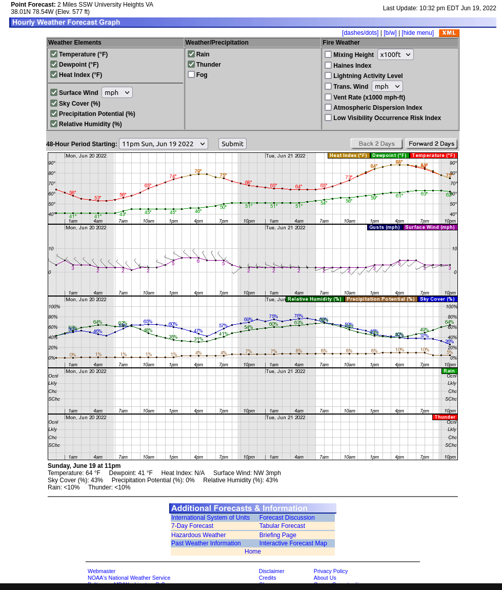

# National Weather Service (dot) IO

weather.gov is pretty brutalist and unusable. Know what's not unusable? Grafana's pretty usable.

So yeah basically I want to scrape weather.gov for the good stuff so I don't have to look at ads.

We (USA citizens) already paid for this damn data anyway. Just let me look at it FFS.

## Data Format

After selecting your location/zip/whatever, there's a link to an "Hourly Weather Forecast", which looks like:



No one in their right mind would use this page daily. This page appears to use 100% SSR, but there's a link to the data in an XML format. This URL has the format:

```
https://forecast.weather.gov/MapClick.php?
    lat=<latitute>&
    lon=<longitude>&
    FcstType=digitalDWML
```

`digitalDWML` means "digital Digital Weather Markup Language", which appears to be an XML format with a somewhat insane tabular data format. Unfortunately the weather.gov endpoint doesn't care if you try setting "Accept: text/json,application/json". The endpoint only returns XML.

The DWML XML Schema is defined here: https://graphical.weather.gov/xml/DWMLgen/schema/DWML.xsd

## More Data Formats

Apparently Weather.gov actually does have an API:

- https://www.weather.gov/documentation/services-web-api
- https://weather-gov.github.io/api/gridpoints
- 
